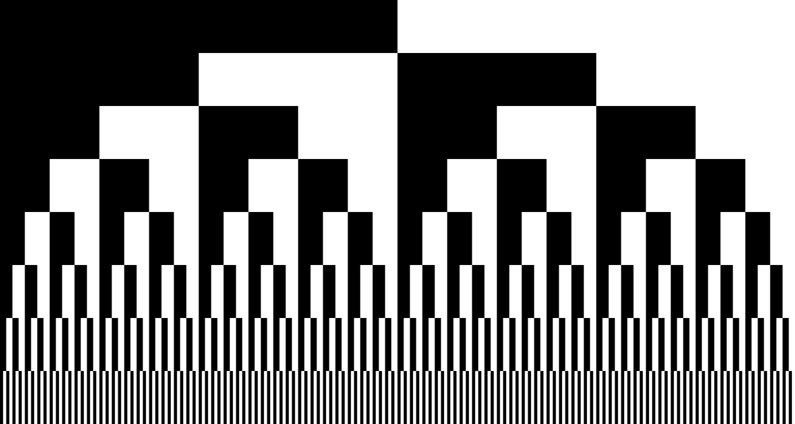
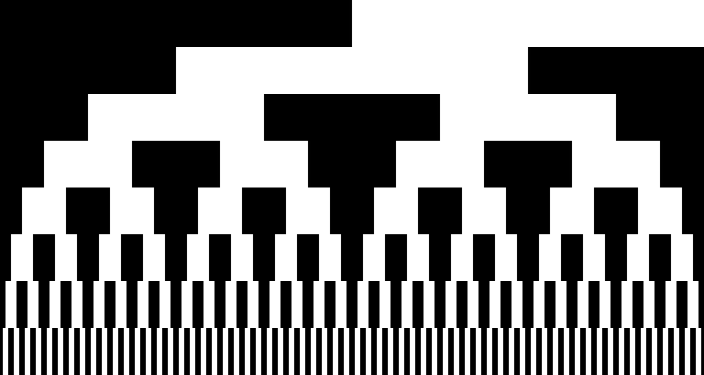
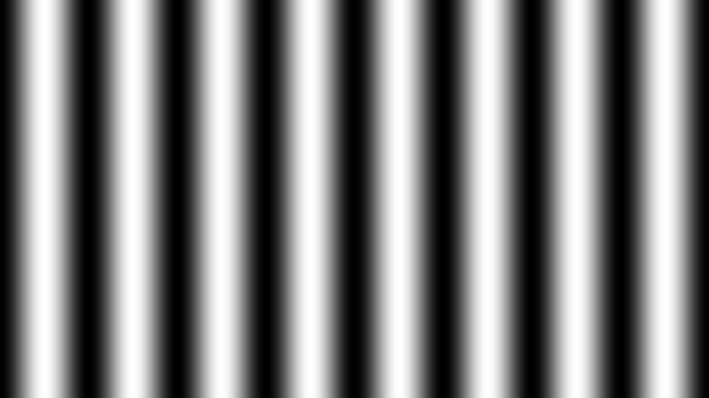

Just compress and stack images onto one image.

Binary_Code_Stack_Pattern:

=======================================================================================================================================
Gray_Code_Stack_Pattern:

=======================================================================================================================================
Phase_Shift_Code(No Stack):

=======================================================================================================================================
